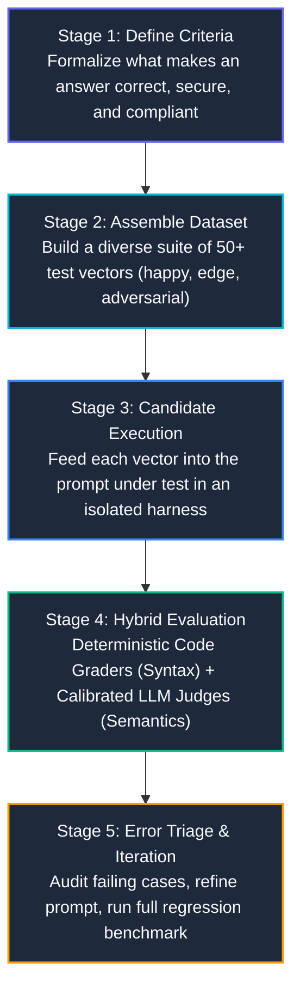

# Lecture 1: The Systematic Evaluation Lifecycle & Datasets

<div class="lms-banner">
  <div style="display: flex; justify-content: space-between; align-items: flex-start; flex-wrap: wrap; gap: 16px;">
    <div>
      <span class="lms-badge-header">
        Module 02 • Unit 1.1
      </span>
      <h1 class="lms-title" style="margin-top: 6px;">
        The Evaluation Lifecycle &amp; Golden Datasets
      </h1>
      <p class="lms-subtitle">
        Moving from subjective "vibe-checking" to rigorous AI engineering. Learn why single-prompt demos fail in production, how to architect a 5-stage evaluation lifecycle, and how to construct diverse golden datasets using fast synthetic generation across Claude and Gemini.
      </p>
    </div>
    <div style="display: flex; flex-direction: column; align-items: flex-end; gap: 8px;">
      <span class="lms-status-pill">
        <span style="width: 8px; height: 8px; border-radius: 50%; background: #10b981;"></span> Core Foundations
      </span>
      <span class="lms-meta-text">Est. Study Time: 15 min • Level: Senior AI Engineering</span>
    </div>
  </div>
</div>

---

## 1. 🎓 The Motivating Problem: The Failure of "Vibe-Checking"

Imagine you are hired as an AI Engineer at an enterprise cloud consultancy. Your team is tasked with building an automated AI coding assistant that generates **AWS infrastructure configurations (JSON)**, **CloudWatch automation scripts (Python)**, and **resource validation patterns (Regex)**.

You sit down at your desk, open your IDE or console, and draft a simple prompt:

```text
Please provide a solution to the following AWS task: {task}
```

You open the web console and test a single sample query:
> *"Write a Python function to list all S3 buckets."*

The model responds in 1.2 seconds with clean, beautifully formatted code:
```python
import boto3

def list_s3_buckets():
    s3 = boto3.client('s3')
    response = s3.list_buckets()
    return [b['Name'] for b in response['Buckets']]
```

It looks fantastic. You send an email to your engineering manager: *"The prompt works! Ready to deploy to production."*

### Within 2 Hours of Production Deployment: The Meltdown

Once real enterprise users and automated CI/CD pipelines begin interacting with your prompt, production collapses across three distinct failure modes:

<div class="lms-bento-grid">

  <div class="lms-bento-card">
    <div style="display: flex; justify-content: space-between; align-items: center; margin-bottom: 8px;">
      <span class="lms-tag-claude">User A: Automated CI/CD Pipeline</span>
      <span class="lms-pill-type" style="color: #ef4444; border-color: rgba(239, 68, 68, 0.3);">Crash: JSON Parse Error</span>
    </div>
    <h3 class="lms-card-title">Downstream Parser Explosion</h3>
    <p class="lms-card-desc">
      <strong>Task:</strong> <em>"Generate a JSON configuration for AWS Lambda."</em><br>
      <strong>What the Model Returned:</strong><br>
      <code>Here is your requested configuration file:<br>```json<br>{"FunctionName": "my-lambda"}...<br>```<br>I hope this helps!</code><br><br>
      <strong>The Fatal Production Impact:</strong> The automated deployment pipeline pipes output directly into <code>jq</code> and <code>json.loads()</code>. The conversational filler causes an unhandled <code>json.JSONDecodeError</code>, immediately halting 14 deployment pipelines.
    </p>
  </div>

  <div class="lms-bento-card">
    <div style="display: flex; justify-content: space-between; align-items: center; margin-bottom: 8px;">
      <span class="lms-tag-gemini">User B: Infrastructure Platform</span>
      <span class="lms-pill-type" style="color: #f59e0b; border-color: rgba(245, 158, 11, 0.3);">Crash: Regex Syntax Error</span>
    </div>
    <h3 class="lms-card-title">Malformed Regular Expression</h3>
    <p class="lms-card-desc">
      <strong>Task:</strong> <em>"Design a regex to validate an EC2 instance ID."</em><br>
      <strong>What the Model Returned:</strong><br>
      <code>^i-[0-9a-f]{8}|[0-9a-f]{17}$</code> (Missing grouping parentheses around the alternation)<br><br>
      <strong>The Fatal Production Impact:</strong> Because the alternation wasn't grouped <code>^(i-[0-9a-f]{8}|i-[0-9a-f]{17})$</code>, the regex mistakenly matched any random 17-digit hex string anywhere in memory, allowing invalid infrastructure identifiers to bypass security checks.
    </p>
  </div>

  <div class="lms-bento-card">
    <div style="display: flex; justify-content: space-between; align-items: center; margin-bottom: 8px;">
      <span class="lms-tag-review">User C: Production Database Admin</span>
      <span class="lms-pill-type" style="color: #dc2626; border-color: rgba(220, 38, 38, 0.3);">Vulnerability: Plaintext Secret</span>
    </div>
    <h3 class="lms-card-title">Security &amp; Best-Practice Violation</h3>
    <p class="lms-card-desc">
      <strong>Task:</strong> <em>"Lambda config with database environment variables."</em><br>
      <strong>What the Model Returned:</strong> Valid JSON with <code>"DB_PASSWORD": "admin_master_password_2026"</code> hardcoded directly in plaintext.<br><br>
      <strong>The Fatal Production Impact:</strong> A string parser deemed the JSON syntactically valid, but committing plaintext database credentials to environment variables triggered an immediate severity-1 enterprise compliance violation.
    </p>
  </div>

</div>

---

### The Amateur Trap vs. The Engineering Solution

When untrained developers face these three crashes, they enter the **Amateur Whack-a-Mole Cycle**:

```
                       ┌─────────────────────────────────────┐
                       │  Step 1: Production Bug Reported    │
                       └──────────────────┬──────────────────┘
                                          │
                                          ▼
                       ┌─────────────────────────────────────┐
                       │  Step 2: Add Ad-Hoc Warning to Text │
                       │ "NEVER output filler! Only JSON!"   │
                       └──────────────────┬──────────────────┘
                                          │
                                          ▼
                       ┌─────────────────────────────────────┐
                       │  Step 3: Test ONCE in Playground    │
                       │ User A's task now works!            │
                       └──────────────────┬──────────────────┘
                                          │
                                          ▼
                       ┌─────────────────────────────────────┐
                       │  Step 4: Redeploy to Production     │
                       │ 💥 Now User B & C behave WORSE!     │
                       └─────────────────────────────────────┘
```

Why did Step 4 happen? Because LLMs are probabilistic, high-dimensional reasoning engines. **Tweaking words in a prompt to fix one edge case frequently causes regressions in other cases.**

> [!IMPORTANT]
> **The Golden Law of AI Engineering**:
> **You cannot improve what you do not measure.**
> 
> In traditional software engineering, you would never refactor a critical backend payment service without a suite of automated unit tests. 
> In AI Engineering, **evaluations (evals) ARE your unit tests**. 
> 
> You must build your evaluation harness **first**, measure your baseline performance across a broad test suite, and only then iterate on prompt wording with statistical validation.

---

## 2. 🗺️ The 5-Stage Scientific Evaluation Framework

An enterprise evaluation pipeline is not a one-off test script. It is a continuous, reproducible 5-stage lifecycle:



Let us break down the first two stages in depth:

---

## 3. 🧪 Designing the Golden Evaluation Dataset

A dataset for evaluating prompts cannot merely contain 2 or 3 convenient questions. A robust golden dataset must cover three distinct categories of inputs:

```
                           ┌─────────────────────────────────────────┐
                           │      Golden Evaluation Dataset          │
                           └────────────────────┬────────────────────┘
                                                │
         ┌──────────────────────────────┬───────┴──────────────────────┐
         ▼                              ▼                              ▼
┌──────────────────┐           ┌──────────────────┐           ┌──────────────────┐
│   Happy Paths    │           │    Edge Cases    │           │Adversarial Inputs│
│   (60% of set)   │           │   (25% of set)   │           │   (15% of set)   │
├──────────────────┤           ├──────────────────┤           ├──────────────────┤
│ Standard routine │           │ Boundary values, │           │ Ambiguous specs, │
│ inquiries to     │           │ missing fields,  │           │ conflicting goals│
│ verify baseline  │           │ nested structures│           │ prompt injection │
│ functionality.   │           │ or large inputs. │           │ attempts.        │
└──────────────────┘           └──────────────────┘           └──────────────────┘
```

### The Anatomy of an Evaluation Vector

Each test case in your dataset must be a structured JSON object containing three required attributes:
1. `task`: The natural language problem statement given to the candidate model.
2. `format`: The required output format (`"json"`, `"python"`, or `"regex"`). This drives deterministic code validation.
3. `solution_criteria`: The explicit, unambiguous technical rubric that the model judge will use to verify semantic correctness.

Here is an example test case from our course dataset [`dataset.json`](dataset.json):

```json
{
  "task": "Create a JSON configuration for an AWS Lambda function that sets environment variables for database connection",
  "format": "json",
  "solution_criteria": "Must include runtime, memory size, timeout, and basic structure for AWS Lambda configuration with environment variables."
}
```

### Deep Dive: Our 5 Production AWS Test Vectors

Let us inspect the 5 test vectors implemented in [`02-prompt-engineering-evals/dataset.json`](file:///Users/saleem/Projects/coursera/02-prompt-engineering-evals/dataset.json):

| Index | Task Description | Format | Key Evaluation Criteria |
| :---: | :--- | :---: | :--- |
| **01** | AWS Lambda DB Configuration | `json` | Must include `Runtime`, `MemorySize`, `Timeout`, and environment variables block. |
| **02** | Extract Region from AWS ARN | `python` | Must parse `arn:partition:service:region:...` and safely handle malformed ARNs. |
| **03** | Validate EC2 Instance ID | `regex` | Must match `i-` followed by 8 or 17 hexadecimal characters with `^` and `$` anchors. |
| **04** | List S3 Buckets with Boto3 | `python` | Must instantiate `boto3.client('s3')`, invoke `list_buckets()`, and extract names. |
| **05** | ReadOnly S3 Bucket IAM Policy | `json` | Must contain `Version: 2012-10-17`, `Effect: Allow`, `s3:GetObject`/`s3:ListBucket`, and resource ARN. |

---

## 4. ⚡ Synthetic Dataset Generation: Scaling with Fast Models

When starting a new AI project, you rarely have 100 high-quality historical customer interactions readily labeled. Writing 50 evaluation test cases by hand can take days.

### The Modern Solution: Model-Generated Synthetic Datasets
We can use an LLM to generate our initial golden evaluation dataset!

However, notice a critical architectural choice:
> [!TIP]
> **Which Model Tier Should You Use to Generate Data?**
> **Always use a fast, lightweight, cost-effective model** (such as **Claude 3.5 Haiku** or **Gemini 3.1 Flash Lite**).
> 
> Generating a dataset of 50 test cases is a volume task that requires diversity and strict adherence to JSON format—not multi-step mathematical theorem proving. Fast models generate 50 cases in seconds at **~95% lower cost** than larger frontier models (Claude 3.5 Sonnet or Gemini 1.5 Pro).

Let us compare the implementation across both leading SDKs:

=== "Anthropic Claude (Assistant Prefill Pattern)"
    In Anthropic's Claude API, we enforce structured JSON output by **prefilling the assistant's turn** with `"```json"`. Because Claude generates text autoregressively, priming the assistant with the opening code block forces the model to begin generating JSON immediately without conversational intros!
    
    ```python
    import json
    from anthropic import Anthropic

    client = Anthropic()

    def generate_eval_dataset(num_cases: int = 5) -> list[dict]:
        prompt = f"""
    Generate an evaluation dataset for an AI prompt evaluation pipeline.
    The dataset will be used to evaluate prompts that generate Python, JSON, or Regex for AWS tasks.
    
    Generate exactly {num_cases} diverse JSON objects. Each object must follow this structure:
    ```json
    [
      {{
        "task": "Specific description of the AWS infrastructure task",
        "format": "json" or "python" or "regex",
        "solution_criteria": "Unambiguous criteria required for a complete and secure solution"
      }}
    ]
    ```
    Ensure a balanced mix of Python, JSON, and Regex tasks.
    """
        messages = [
            {"role": "user", "content": prompt},
            # 🔑 Assistant prefill forces direct JSON generation without conversational text
            {"role": "assistant", "content": "```json"}
        ]
        
        # Stop immediately when the closing triple-backticks appear
        response = client.messages.create(
            model="claude-3-5-haiku-20241022",
            max_tokens=2048,
            temperature=0.7,
            stop_sequences=["```"],
            messages=messages
        )
        
        # Parse raw text directly into Python list
        raw_json = response.content[0].text
        dataset = json.loads(raw_json)
        return dataset
    ```

=== "Google Gemini (Native Pydantic Schema Enforcement)"
    In Google's `google-genai` SDK, we do not need prompt tricks or prefilled prefixes. Gemini natively constrains the decoder's token probabilities to strictly emit valid JSON adhering to a Pydantic schema:
    
    ```python
    import json
    from pydantic import BaseModel, Field
    from google import genai
    from google.genai import types

    client = genai.Client()

    class TestCase(BaseModel):
        task: str = Field(description="Description of AWS task requiring Python, JSON, or Regex")
        format: str = Field(description="One of: 'json', 'python', 'regex'")
        solution_criteria: str = Field(description="Specific criteria needed to evaluate solution quality")

    def generate_eval_dataset(num_cases: int = 5) -> list[dict]:
        prompt = f"Generate {num_cases} diverse evaluation test cases for AWS Python, JSON, and Regex engineering tasks."
        
        # 🔑 Gemini native schema enforcement guarantees 100% schema compliance
        response = client.models.generate_content(
            model="gemini-3.1-flash-lite",
            contents=prompt,
            config=types.GenerateContentConfig(
                response_mime_type="application/json",
                response_schema=list[TestCase],
                temperature=0.7,
            ),
        )
        
        return json.loads(response.text)
    ```

---

## 5. 🧑‍🏫 Professor's Key Takeaways

1. **Vibe-checking is not engineering**: Testing a prompt on one or two hand-crafted inputs gives a false sense of security. Real users will always uncover unhandled edge cases.
2. **Evals precede prompt refinement**: Never change prompt wording without an existing evaluation dataset to measure whether your change caused regressions.
3. **Structured data matters**: Every test case must explicitly pair a `task` with an expected `format` and clear `solution_criteria`.
4. **Use cost-efficient models for data generation**: Synthetic dataset generation should be offloaded to fast models (Haiku / Flash Lite) to preserve budget for rigorous evaluation.

---

<div style="display: flex; justify-content: space-between; align-items: center; margin-top: 32px; padding-top: 16px; border-top: 1px solid var(--card-border);">
  <a href="../" style="font-weight: 600; text-decoration: none;">&larr; Back to Module 02 Syllabus</a>
  <a href="../02-grading-strategies/" style="font-weight: 600; text-decoration: none;">Proceed to Lecture 2: Hybrid Grading Strategies &rarr;</a>
</div>
