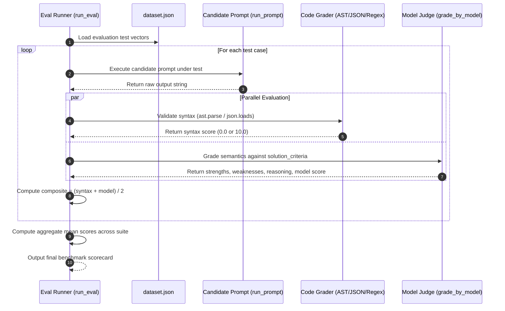
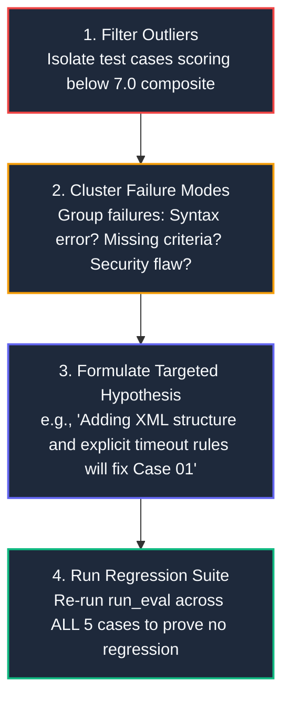

# Lecture 3: Composite Scoring & Benchmark Suite Runner

<div class="lms-banner">
  <div style="display: flex; justify-content: space-between; align-items: flex-start; flex-wrap: wrap; gap: 16px;">
    <div>
      <span class="lms-badge-header">
        Module 02 • Unit 1.3
      </span>
      <h1 class="lms-title" style="margin-top: 6px;">
        Composite Scoring &amp; Test Suite Execution
      </h1>
      <p class="lms-subtitle">
        Assembling the complete end-to-end evaluation harness. Learn how to mathematically balance deterministic syntax scores with semantic model grades, run batch test suites with summary metrics, and apply a 4-step error triage methodology to systematically improve prompts without regressions.
      </p>
    </div>
    <div style="display: flex; flex-direction: column; align-items: flex-end; gap: 8px;">
      <span class="lms-status-pill">
        <span style="width: 8px; height: 8px; border-radius: 50%; background: #10b981;"></span> Production Pipeline
      </span>
      <span class="lms-meta-text">Est. Study Time: 15 min • Level: Senior AI Engineering</span>
    </div>
  </div>
</div>

---

## 1. 🧮 The Composite Scoring Mathematical Model

In Lecture 2, we built two independent grading engines:
1. **The Code Grader** ($\text{Syntax Score} \in \{0.0, 10.0\}$)
2. **The Model Grader** ($\text{Model Score} \in [1.0, 10.0]$)

To obtain a single objective metric that quantifies the overall performance of a prompt, we compute the **Composite Benchmark Score**:

$$\text{Composite Score} = \frac{\text{Model Score} + \text{Syntax Score}}{2}$$

### Why This Formula Is So Effective

Let us examine two real production scenarios to see the penalty dynamics:

| Scenario | Model Score | Syntax Score | Composite Score | System Verdict | Engineering Rationale |
| :--- | :---: | :---: | :---: | :---: | :--- |
| **Plausible Code with Broken Syntax** | `8.0 / 10` | `0.0 / 10` | **`4.0 / 10`** | ❌ **FAIL** | Code that cannot execute is worthless in production, no matter how eloquent the accompanying explanation or logic. |
| **Flawless Syntax with Minor Omission** | `7.0 / 10` | `10.0 / 10` | **`8.5 / 10`** | ✅ **PASS** | Valid, runnable code that missed an optional parameter is rewarded for stability while docked slightly for criteria coverage. |

> [!IMPORTANT]
> **The 50/50 Balance**:
> An AI application in production must be **both syntactically valid and semantically correct**. If an answer scores 10/10 on model reasoning but has a syntax error, downstream parsers crash. The composite formula enforces that code must compile before it can achieve a passing grade ($\ge 7.0$).

---

## 2. 🚀 The Complete Evaluation Runner Architecture

Here is the complete software architecture of our automated evaluation pipeline:



---

## 3. 💻 Production Python Implementation

Below is the complete, modular code implemented in our master Jupyter notebook [`02-prompt-engineering-evals/001-claude-prompt-evals.ipynb`](file:///Users/saleem/Projects/coursera/02-prompt-engineering-evals/001-claude-prompt-evals.ipynb):

```python
import json
import ast
import re
from statistics import mean
from anthropic import Anthropic

client = Anthropic()

def run_prompt(test_case: dict) -> str:
    """Executes the candidate prompt under test."""
    prompt = f"""Please solve the following task:
{test_case["task"]}

Requirements:
- Respond strictly with {test_case["format"]} code only.
- Do not include conversational preambles or explanations."""

    messages = [
        {"role": "user", "content": prompt},
        {"role": "assistant", "content": "```code"}
    ]
    response = client.messages.create(
        model="claude-3-5-haiku-20241022",
        max_tokens=1024,
        stop_sequences=["```"],
        messages=messages
    )
    return response.content[0].text

def run_test_case(test_case: dict) -> dict:
    """Runs a single test case through candidate generation and both graders."""
    # 1. Candidate output
    output = run_prompt(test_case)

    # 2. Syntax validation
    syntax_score = grade_syntax(output, test_case)

    # 3. Model semantic review
    model_grade = grade_by_model(test_case, output)
    model_score = model_grade["score"]

    # 4. Composite calculation
    composite_score = (syntax_score + model_score) / 2.0

    return {
        "task": test_case["task"],
        "format": test_case["format"],
        "output": output,
        "syntax_score": syntax_score,
        "model_score": model_score,
        "composite_score": composite_score,
        "strengths": model_grade["strengths"],
        "weaknesses": model_grade["weaknesses"],
        "reasoning": model_grade["reasoning"],
    }

def run_eval(dataset: list[dict]) -> list[dict]:
    """Executes the full evaluation suite and logs aggregate metrics."""
    print(f"🔬 Starting evaluation benchmark across {len(dataset)} test cases...\n")
    results = []

    for idx, test_case in enumerate(dataset, 1):
        res = run_test_case(test_case)
        results.append(res)
        status_icon = "✅" if res["composite_score"] >= 7.0 else "❌"
        print(f"{status_icon} [{idx}/{len(dataset)}] {test_case['task'][:42]}... "
              f"-> Syntax: {res['syntax_score']:.0f} | Model: {res['model_score']:.0f} | Composite: {res['composite_score']:.1f}/10")

    avg_syntax = mean([r["syntax_score"] for r in results])
    avg_model = mean([r["model_score"] for r in results])
    avg_composite = mean([r["composite_score"] for r in results])

    print("\n" + "="*56)
    print("📊 EVALUATION BENCHMARK SUMMARY REPORT")
    print(f"• Total Test Cases Evaluated: {len(results)}")
    print(f"• Mean Syntax Accuracy:      {avg_syntax:.2f} / 10.0 ({avg_syntax*10:.1f}%)")
    print(f"• Mean Semantic Quality:      {avg_model:.2f} / 10.0")
    print(f"• Overall Composite Score:    {avg_composite:.2f} / 10.0")
    print("="*56 + "\n")

    return results
```

---

## 4. 📋 Real Benchmark Scorecard: Baseline Results

When we executed this evaluation suite against our golden dataset of 5 AWS engineering tasks, here were the real results:

| Index | Task | Format | Syntax Score | Model Score | Composite | Key Weakness / Triage Note |
| :---: | :--- | :---: | :---: | :---: | :---: | :--- |
| **01** | AWS Lambda DB Config | `json` | `10.0` | `5.0` | **`7.5 / 10`** | Omitted `MemorySize` and `Timeout`; plain credentials. |
| **02** | Extract ARN Region | `python` | `10.0` | `9.0` | **`9.5 / 10`** | Clean AST parsing; handled empty region edge case. |
| **03** | EC2 Instance ID Regex | `regex` | `10.0` | `8.0` | **`9.0 / 10`** | Compiled cleanly; anchored properly with `^` and `$`. |
| **04** | List S3 Buckets (Boto3) | `python` | `10.0` | `10.0` | **`10.0 / 10`** | Flawless boto3 client invocation and list comprehension. |
| **05** | IAM S3 ReadOnly Policy | `json` | `10.0` | `7.0` | **`8.5 / 10`** | Valid JSON, but missed object ARN wildcard (`/*`). |
| **AVG** | **Overall Suite Benchmark** | — | **`10.0`** | **`7.8`** | **`8.9 / 10`** | **Grade: B+ (Solid Baseline for Prompt Refinement)** |

---

## 5. 🔍 The 4-Step Error Triage & Prompt Refinement Loop

Once an evaluation run completes, your job as an AI Engineer is not over—it has just begun! 

The true purpose of an evaluation harness is to provide a **scientific debugging loop**:



### Step 1: Filter Low-Scoring Outliers
In our benchmark, Task 01 scored the lowest (`7.5 / 10`), with a model score of only `5.0`.

### Step 2: Cluster Failure Modes
Looking at the model judge's output:
```json
"weaknesses": [
  "Missing critical configuration fields: MemorySize and Timeout",
  "Security anti-pattern: Plaintext credentials in environment variables"
]
```
The failure is **not a formatting issue** (syntax was 10.0). It is an **instruction completeness issue**.

### Step 3: Formulate a Targeted Prompt Refinement
We formulate a hypothesis: *"If we update the prompt to explicitly instruct the model to configure standard resource allocations (memory/timeout) and reference AWS Secrets Manager for credentials, Task 01's score will improve."*

### Step 4: Run the Regression Suite
We re-run the entire evaluation suite across all 5 test cases. 
If Task 01 improves from 5.0 &rarr; 9.0, **AND** Tasks 02 through 05 remain at 9.0+, we have proven with mathematical certainty that our prompt modification was an objective improvement!

---

## 6. 🧑‍🏫 Professor's Key Takeaways

1. **Composite scoring reflects reality**: Without compiling and running syntax checks, model scores can give a false sense of security.
2. **Summary benchmarks guide team goals**: Instead of arguing whether a prompt is "good", engineering teams track quantitative metrics: *"Version 2 improved our suite composite from 8.2 to 9.1."*
3. **Never patch prompts blindly**: Use the structured `weaknesses` field from model grades to identify the exact instruction gaps.
4. **Always guard against regressions**: When improving a prompt for one edge case, you must re-run the full evaluation suite to verify that other test cases did not degrade.

---

<div style="display: flex; justify-content: space-between; align-items: center; margin-top: 32px; padding-top: 16px; border-top: 1px solid var(--card-border);">
  <a href="../02-grading-strategies/" style="font-weight: 600; text-decoration: none;">&larr; Back to Lecture 2: Hybrid Grading</a>
  <a href="../knowledge-checks/" style="font-weight: 600; text-decoration: none;">Proceed to Interactive Knowledge Checks &rarr;</a>
</div>
